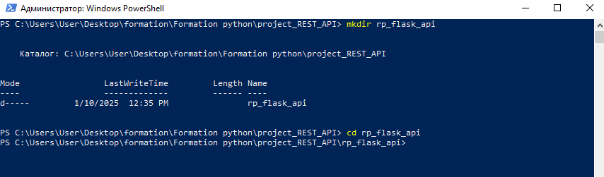
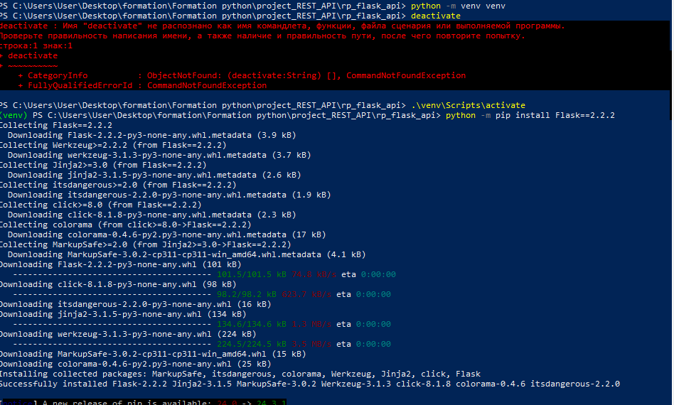
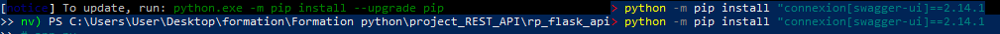
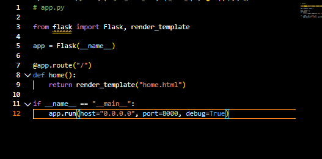
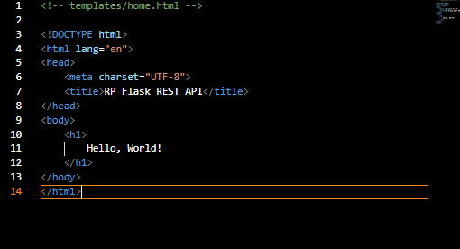
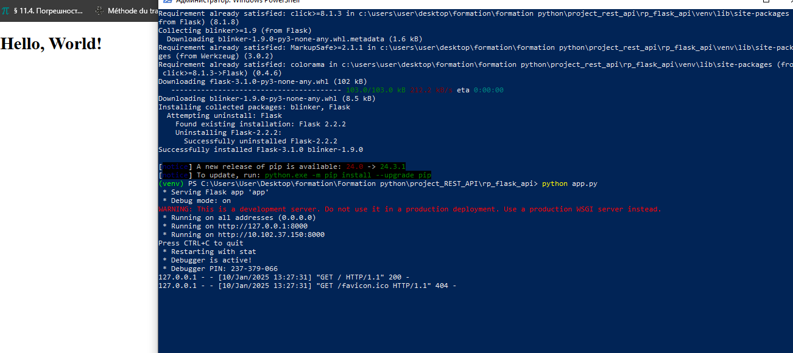
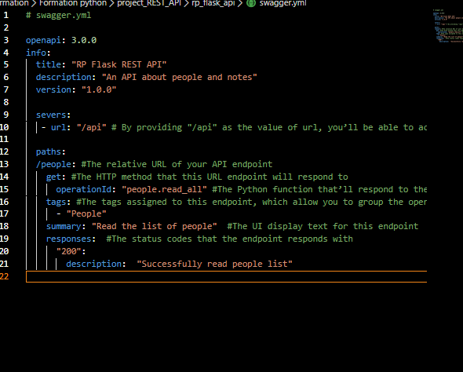
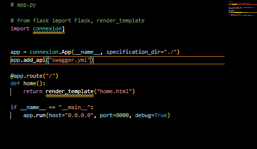
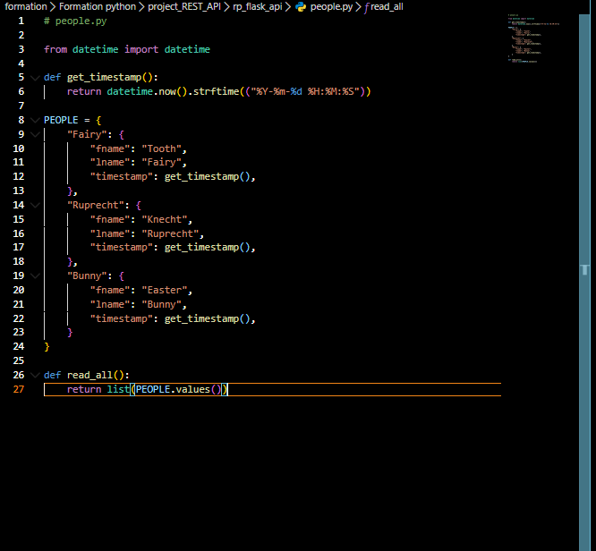
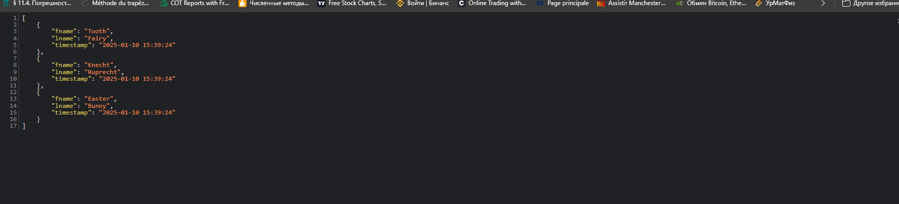

# **Python REST APIs With Flask, Connexion, and SQLAlchemy**

## Project 
 - Build a base Flask project with a REST API
 - Handle HTTP requests with Connexion
 - Define API endpoints using the OpenAPI specification
 - Interact with your API to manage data
 - Build API documentation with Swagger UI

## CREATING THE VIRTUAL ENVIRONNEMENT FOR OUR PROJECT 
creating our virtual environmment, i need to pass these two commande that help us create our working spaces (folders) and get access to it .

After creating the workfolders, now create and activate the virtual env named venv by using these commands as shwon on screeshoot.

Then now install Flask==2.2.2 , which the web **micro web framework** and the **connexion** to handle HTTP requests.

And Create app.py in rp_flask_api/ and add the following content:

Flask expects home.html in a template directory named templates/. Create the templates/ directory and add home.html and Ensure that the templates directory at the same level as your app.py file. Inside this directory, create a home.html file with some basic HTML content, such as:

after lauching my app.py 

here how my Flask project structure look like:

    rp_falsk_api/
    |
    |
    |--- templates/
    |
    |--- venv
    |
    |____ app.py

## Adding My First  REST API Endpoint

The Connexion module allows a Python program to use the OpenAPI specification with Swagger. The OpenAPI Specification is an API description format for REST APIs and provides a lot of functionality, including:

-  Validation of input and output data to and from your API
- Configuration of the API URL endpoints and the expected parameters

let first create the API configuration file, it should be YAML or JSON extension file. will create and name it **swagger.yml**

and next adding connexion to app.py, which can be in two steps:

    - Add an API configuration file to your project.
    - Connect your Flask app with the configuration file.

to Return Data From Your People Endpoint, we then create a new file named people.py which is the callings function of the API when it get an HTTP request for the get /api/people as follow .
note:: In line 5, a helper function named get_timestamp() that generates a string representation of the current timestamp.

Then the first APi been created !!!

[**This is the initial Swagger interface**]<video controls src="video-1.mp4" title="Title"></video> 